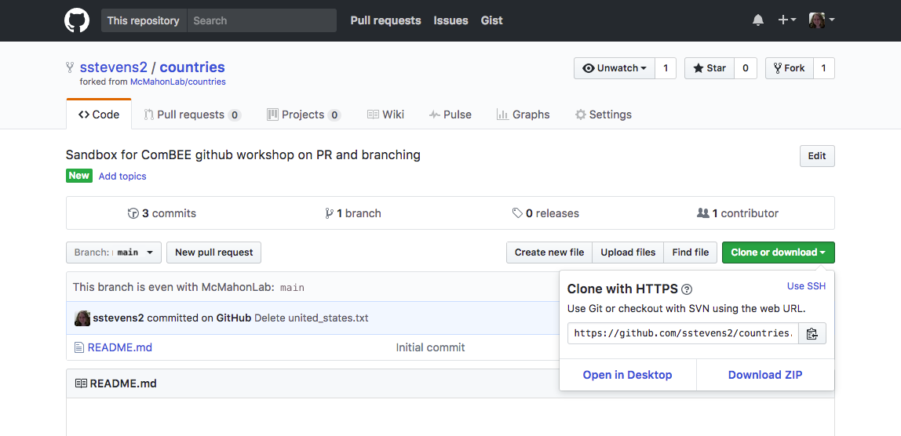
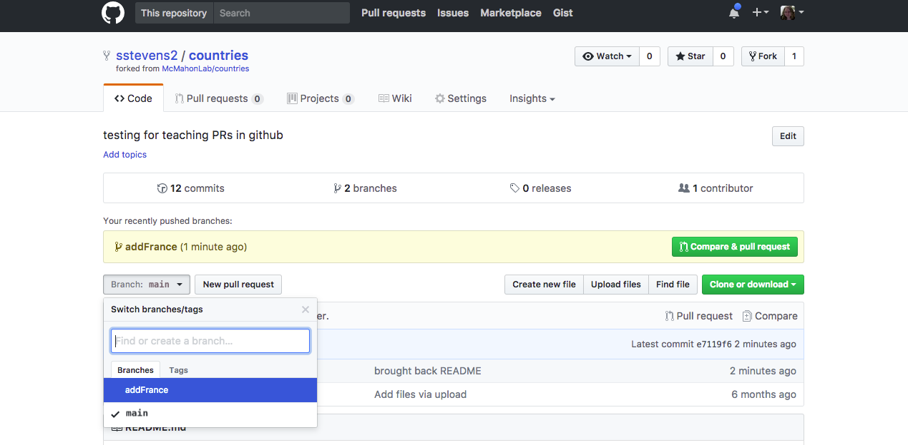

Pull requests are a great way to collaborate with others using github.
Instead of making changes directly to a repository you can suggest changes to a repo.
This can be useful if you don't have permission to modify a repository directly or
you want someone else to review your changes.

For this lesson we will be working on the `countries` repository together.
Open the github link for the `countries` repo provided by the instructor 
in your browser window.

> ## Repo owner differences
>
> You may have noticed that the `countries` repo in this lesson's pictures 
> is owned by the 'McMahonLab' organization and this doesn't match
> the address you were given.
> This is to be expected because this will differ depending on 
> what organization your instructor used to setup the `countries` repo.
> 
> You will also see your username where the 'sstevens2' is in the picutres.
> 
{: .callout}

Once at the `countries` repo, click the **Fork** button which can be found
in the upper right hand conner of the window. 
Forking the repository makes us each our own copy of the repo in our github 
account which we can edit.

Next we need to get this repo on our local computer and
setup connections from our computer to both our forked version 
and the authoritative version we forked it from.

First we will **clone** the repo from our forked version.
The clone command does two things:
	1. Copies the repo to your local computer
	2. Sets up a connection called 'origin' between your computer and the github repo
Copy the web address for your forked version of repo 
(from the web address line or click 'clone and download' and copy that).

In terminal or Gitbash, navigate to a folder you'd like to hold this repo,
we will place it on our `Desktop`.
Once there you can use the `clone` command with the link you copied as the first argument.

~~~
$ cd Desktop
$ git clone https://github.com/USERNAME/countries.git
~~~
{: .bash}

> ## Why does the command above say 'USERNAME'?
>
> So that we can't copy the command above and accidently clone someone else's
> version of countries to our computer the command above uses the placeholder
> 'USERNAME' where you should put your own username if your copied from above
> instead of copying the link from your browser and pasting it into the command.
> 
> 
{: .callout}

~~~
Cloning into 'countries'...
remote: Counting objects: 6, done.
remote: Compressing objects: 100% (4/4), done.
remote: Total 6 (delta 0), reused 6 (delta 0), pack-reused 0
Unpacking objects: 100% (6/6), done.
~~~
{: .output}

Next we will set up a connection or **remote** to the authoritative repository 
(the original version given to you by your instructor).
In your browser, you can go back this repo by clicking on the link that says 'forked from'
in the upper left hand corner, under your username and repo name.

Copy the web address for this repo 
(from the web address line or click the 'clone and download' and copy that).

Then back in your terminal, navigate in the cloned repo and add the remote connection.
For this command we must give the new connection a different nickname, 
where our original connection is 'origin'
this new connection will be called 'upstream'.
You could give it a different nickname but 'upstream' is a common nickname for
the authoritative repository.

~~~
$ cd countries
$ git remote add upstream https://github.com/INSTRUCTOR-GIVEN/countries.git
~~~
{: .bash}

> ## If you tried copying the command above...
>
> You will have to replace 'INSTRUCTOR-GIVEN' with the site your instructor
> indicated at the beginning of this lesson. This will vary depending
> on how your instructor set up for this lesson.
> 
> 
{: .callout}

At anytime you can see the remote connections your repo has using the following command:

~~~
$ git remote -v
~~~
{: .bash}

~~~
origin	https://github.com/USERNAME/countries.git (fetch)
origin	https://github.com/USERNAME/countries.git (push)
upstream	https://github.com/INSTRUCTOR-GIVEN/countries.git (fetch)
upstream	https://github.com/INSTRUCTOR-GIVEN/countries.git (push)
~~~
{: .output}

Now that we have this setup done, which is only needed the first time, 
we can now suggest changes to this repo.
Each person will add a new file with info about a new country in it.

The instructor will now add a single file to the repository containing 
information about the the United States.

Next, we will update our local version of the repo, with this change by `pull`ing down
the changes from the 'upstream' version's master branch.

~~~
$ git pull upstream master
~~~
{: .bash}

Now your local version of the repo is updated but our forked version of the 
repo is not yet up to date.
You can reload your fork in github and see it does not contain the new 
`united_states.txt` file.
Now we need to update the our forked version.
To do so we can `push` the changes in our local version to the master branch of our fork, 
called 'origin'.

~~~
$ git push origin master
~~~
{: .bash}

Now let's each add a new country to the repository.
First let's make a new branch to work on.  This will keep our 'master' version
in sync with the authoritative version of the repository.
We can name our branch descriptively after the country we will be adding 
Mine will be `addFrance` since I'll be working with France.
Please pick a different country and shout it out (or add it to the etherpad) 
so no one else chooses the same one.
We will create the branch and switch into in one step 
as we learned earlier in the branching lesson.
Finally before we proceed to adding the new file, we will double 
check that we are on the right branch.

~~~
$ git checkout -b addFrance
$ git branch
~~~
{: .bash}

~~~
* addFrance
  master
~~~
{: .output}

Next we will copy `united_states.txt` and change the name to the name of our chosen country.
Then we can use nano to edit the contents to reflect the info of your chosen country.  
Hint: You may need to do some internet searching to fill in the information.

~~~
$ cp united_states.txt france.txt
$ nano france.txt
$ cat france.txt
~~~
{: .bash}

~~~
Population: 66,991,000
Capitol: Paris
~~~
{: .output}

Next let's add and commit the changes to the repo.

~~~
$ git add france.txt
$ git commit -m "Added file on france"
~~~
{: .bash}

~~~
[addFrance 79a312a] Added file on france
 1 file changed, 2 insertions(+), 2 deletions(-)
~~~
{: .output}

Now we can push those changes to our forked version of the repo.
Since we don't have permissions to the upstream repo or we want to suggest these changed be
reviewed, if we do have permissions, we won't push directly to the upstream repo.
Remember we need to push the name of our new branch.

~~~
$ git push origin addFrance
~~~
{: .bash}

~~~
Counting objects: 4, done.
Delta compression using up to 4 threads.
Compressing objects: 100% (4/4), done.
Writing objects: 100% (4/4), 783 bytes | 0 bytes/s, done.
Total 4 (delta 3), reused 0 (delta 0)
remote: Resolving deltas: 100% (3/3), completed with 3 local objects.
To https://github.com/USERNAME/countries.git
   2037539..79a312a  master -> master
~~~
{: .output}

Next go to your forked github version of the repo and reload the page.
You won't see the new file added in the list of files but you will see 
that you recently pushed a new branch to the repository.

If you wish to view your new branch you can click on the 'Branch' drop down menu
and select that branch.

Then you should be able to view the files and commits in that branch.

Github already suspects that we are going to want to make a pull request so we can click
the 'Compare & pull request' button to start a new pull request.

Then click the 'New pull request' button.

The base fork should be the upstream/authoritative version's master branch and then 
the head fork should be the new branch of our fork.
You can add more information into the comment section if there is anything you'd like 
to add for the person who reviews your suggestion.
Then you can click the 'create pull request button' to submit the pull request.

Now someone with privileges to the upstream repo can review it, give comments and
suggestions, and merge it into the upstream version.

Our collaborator reviewing the pull request noticed that 
we forgot to add the largest city so let's add it and update our pull request.

~~~
$ nano france.txt
$ cat france.txt
~~~
{: .bash}

~~~
Population: 66,991,000
Capitol: Paris
Largest City: Paris
~~~
{: .output}

Next we will add and commit these changes.
Then we can push them to our forked version of the repo.

~~~
$ git add france.txt
$ git commit -m "Added largest city to france file"
$ git push origin addFrance
~~~
{: .bash}

Now if we reload the pull request.  The new commit was added to that pull request.
New commits pushed to the same branch are included in the previous pull request.
If you want to suggest changes separately you need to make separate branches but 
if you want the changes to be considered together you should put them in the same branch.

> ## Add new country file and make additional PR
>
> - Starting in the master branch make a new branch
> - Copy other country file into a new country
> - Edit the file to include info on the new country
> - Add and commit this new file
> - Push the new changes to github
> > ## Solution
> >
> > ~~~
> > $ git checkout master
> > $ git checkout -b addItaly
> > $ cp united_states.txt italy.txt
> > $ nano italy.txt #Add the right info into the file
> > $ git add italy.txt
> > $ git commit -m "Added file on Italy"
> > $ git push origin addItaly
> > ~~~
> > {: .bash}
> {: .solution}
{: .challenge}

